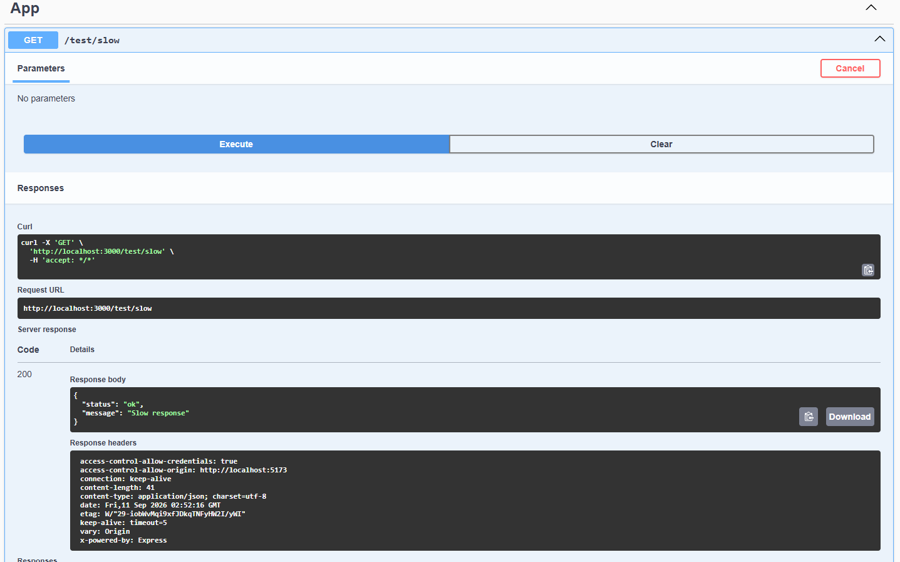

## Орчны мэдээлэл

- **Үйлдлийн систем**: WSL (Ubuntu)
- **k6 хувилбар**:

  

- **Сервер**: https://test.k6.io, Local NestJS Backend, https://httpbin.org

## Суурь ба ачааллын тестүүдийн үр дүн

Алхам 2-н дагуу script.js -ийг 5, 30, 100 Virtual Users түвшин тус бүрд 1 минутын хугацаатай ажиллуулж, үр дүнгийн текстүүдийг results/ хавтсанд харин screenshot зургуудыг results/images хавтсанд хадгалсан.

| VU-ийн тоо | Avg Latency | p90 Хугацаа | p95 Хугацаа | Throughput   | Error Rate |
| ---------- | ----------- | ----------- | ----------- | ------------ | ---------- |
| 5 VU       | 159.12 ms   | 274.31 ms   | 280.99 ms   | 7.47 req/s   | 0.00%      |
| 30 VU      | 160.48 ms   | 275.87 ms   | 288.80 ms   | 44.72 req/s  | 0.00%      |
| 100 VU     | 141.10 ms   | 223.21 ms   | 224.75 ms   | 150.12 req/s | 0.00%      |

## Stages тестийн ажиглалт

stages_script.js ашиглан ачааллыг дараалан өсгөж бууруулах 2.5 минутын туршилт хийсэн:

- Өсөх үе: Хэрэглэгчийн тоо 5, 30, 100 VU болон өсөхөд систем дэх нэвтрүүлэх чадвар буюу Throughput шугаман байдлаар нэмэгдсэн.
- Оргил үе: Ачаалал өсөж, 100 VU-д хүрэх үед дундаж хариу өгөх хугацаа $p(95) = 224.64\text{ ms}$ байсан бөгөөд туршилтын турш дунджаар $47.16\text{ req/s}$ (нийт 7108 хүсэлт) ачааллыг ямар ч алдаагүй боловсруулсан.
- **Буурах үе (Ramp-down)**: Ачаалал буурч 0 VU болоход систем эргэн хэвийн тайван төлөвт саадгүй шилжсэн.

## SLO ба Threshold-н тохируулга

- **Динамик Threshold үндэслэл**: 5 VU суурь тестийн p(95) хугацаа 280.99 ms гарсан. Иймээс SLO шалгуурыг $280.99 \times 1.5 = 421.48\text{ ms}$ буюу ойролцоогоор p(95) < 500ms гэж тохируулсан. Сүлжээний хэлбэлзлийг тооцож босго тавьснаар false alarm-аас сэргийлнэ.
- **PASS ба FAIL Шалгалт**:
  - threshold_pass.js (p(95) < 500ms): Тест PASS гарсан (p(95) = 266.47ms).
  - threshold_fail.js (p(95) < 50ms): Санаатайгаар биелэх боломжгүй шалгуур тавьж FAIL болохыг баталгаажуулсан (p(95) = 285.99ms).

## Локал серверийн харьцуулсан тест

Локал NestJS сервер дээр 30 VU-ээр 30 секундийн турш хурдан болон саатуулсан хоёр эндпоинтыг харьцуулан хэмжсэн:

- **Энгийн endpoint (`/api/docs-json`)**: $p(95) = \mathbf{14.78\text{ ms}}$, Нэвтрүүлэх чадвар = $\mathbf{29.83\text{ req/s}}$, Алдаа = $\mathbf{0.00\%}$
- **100ms сааталтай endpoint (`/test/slow`)**: $p(95) = \mathbf{106.68\text{ ms}}$, Нэвтрүүлэх чадвар = $\mathbf{27.15\text{ req/s}}$, Алдаа = $\mathbf{0.00\%}$

**Дүгнэлт**: Серверийн кодонд нэмсэн 100ms-ийн саатал нь $p(95)$ хугацааг шууд $106.68\text{ ms}$ болгон уртасгаж байгаа нь гадаад сүлжээний хэлбэлзэлгүйгээр кодын түвшний боловсруулалтыг локал орчинд бодитой хэмжиж болохыг харууллаа.

## Дүгнэлт

Энэхүү лабораторийн ажлаар k6 хэрэгслийг ашиглан системд ирэх ачаалал болон гүйцэтгэлийн үзүүлэлтүүдийн хамаарлыг туршин судаллаа. Лекц 2-т үзсэнчлэн зэрэгцээ хэрэглэгчийн тоо 5-аас 100 болж өсөхөд системийн нэвтрүүлэх чадвар **7.47 req/s**-ээс **150.12 req/s** хүртэл шугаман хамааралтайгаар өссөн. Лекцийн Latency ба Нэвтрүүлэх чадварын хамаарлын дагуу ачаалал ихсэхэд систем эвдрэлгүйгээр $0.00\%$ Error Rate дээд хязгаартаа тултал амжилттай боловсруулж байна. Системийн чанарыг үнэлэхдээ дундаж хугацаанаас илүү хамгийн удаан 5%-ийн хэрэглэгчийн туршлагыг харуулдаг p95 percentile хэмжүүр хамгийн чухал болохыг туршилтаар баталсан. 5 VU baseline хэмжилтэд үндэслэн dynamic threshold тохируулж SLO шалгуур үүсгэснээр continuous integration (CI) дамжлага дээр гүйцэтгэлийн бууралтыг автоматаар барих боломжтойг харлаа. Локал NestJS сервер дээрх туршилт нь сүлжээний сааталгүйгээр кодын түвшний 100ms саатлыг хэмжиж чадсан. Мөн AI-аар үүсгүүлсэн код нь Basic Auth болон POST хүсэлтийг дуудаж, хэрэглэгчийн нэвтрэх, хайх дарааллыг бодитоор симуляци хийж чадсан. Туршилтын турш алдааны хувь 0.00% байж, тодорхойлсон бүх SLO шалгуурууд амжилттай хангагдлаа.
