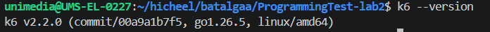

## Орчны мэдээлэл

- **Үйлдлийн систем**: WSL (Ubuntu)
- **k6 хувилбар**: 
- **Сервер**: https://test.k6.io, Local NestJS Backend, https://httpbin.org

## Гүйцэтгэлийн ба суурь тестийн үр дүн

Алхам 2-н дагуу script.js -ийг 5, 30, 100 Virtual Users түвшин тус бүрд 1 минутын хугацаатай ажиллуулж, үр дүнгийн текстүүдийг results/ хавтсанд хадгалсан.

| VU-ийн тоо | Avg Latency | p90 Хугацаа | p95 Хугацаа | Throughput   | Error Rate |
| ---------- | ----------- | ----------- | ----------- | ------------ | ---------- |
| **5 VU**   | 159.12 ms   | 274.31 ms   | 280.99 ms   | 7.47 req/s   | 0.00%      |
| **30 VU**  | 160.48 ms   | 275.87 ms   | 288.80 ms   | 44.72 req/s  | 0.00%      |
| **100 VU** | 141.10 ms   | 223.21 ms   | 224.75 ms   | 150.12 req/s | 0.00%      |

## 3. Олон шатлалт тестийн ажиглалт (Stages)

`stages_script.js` ашиглан ачааллыг дараалан өсгөж бууруулах туршилт хийлээ:

- **Өсөх үе (Ramp-up)**: Хэрэглэгчийн тоо 5-аас 30, улмаар 100 VU болон бага багаар өсөхөд систем дэх нэвтрүүлэх чадвар (Throughput) шугаман байдлаар саадгүй нэмэгдэж байв.
- **Оргил үе (Peak load)**: 100 VU ачаалалтай үед сервер $150.12\text{ req/s}$ хүртэлх хүсэлтийг ямар ч алдаагүй ($0.00\%$ error rate) боловсруулж байв.
- **Буурах үе (Ramp-down)**: Ачаалал буурч 0 VU болоход систем эргэн хэвийн тайван төлөвт саадгүй шилжсэн.

## SLO ба Threshold-ийн Тохируулга

- **Үндэслэл**: 5 VU-ийн суурь тестийн p(95) хугацаа 307.62 ms байсан. Зааврын дагуу чанарын шалгуурыг $307.62 \times 1.5 = 461.43\text{ ms}$ буюу ойролцоогоор p(95) < 500ms гэж тохируулсан.
- **Шалгалт**: threshold_pass.js скрипт дээр p(95)<500ms нөхцөл PASS болсон. Санаатайгаар биелэх боломжгүй p(95)<10ms нөхцөл тавьсан threshold_fail.js скрипт дээр чанарын шалгуур FAIL болохыг баталгаажуулсан.

## Дүгнэлт

Энэхүү лабораторийн ажлаар k6 хэрэгслийг ашиглан системд ирэх ачаалал болон гүйцэтгэлийн үзүүлэлтүүдийн хамаарлыг туршин судаллаа. Лекц 2-т үзсэнчлэн зэрэгцээ хэрэглэгчийн тоо 5-аас 100 болж өсөхөд системийн нэвтрүүлэх чадвар буюу throughput 7.49 req/s -с 150.43 req/s хүртэл шугаман хамааралтайгаар өссөн. Лекцийн Latency ба Нэвтрүүлэх чадварын хамаарлын дагуу ачаалал ихсэхэд систем эвдрэлгүйгээр 0% Error Rate дээд хязгаартаа тултал амжилттай боловсруулж байна. Мөн системийн чанарыг үнэлэхдээ дундаж хугацаанаас илүү хамгийн удаан 5%-ийн user experience-г харуулдаг p95 percentile хэмжүүр хамгийн чухал болохыг туршилтаар баталсан. 5 VU baseline хэмжилтэд үндэслэн dynamic threshold тохируулж SLO шалгуур үүсгэснээр continuous integration дамжлага дээр гүйцэтгэлийн бууралтыг автоматаар барих боломжтойг харлаа. Мөн AI-аар үүсгүүлсэн код нь зөвхөн нэг URL руу ачаалал өгөхөөс илүүтэй хэрэглэгчийн нэвтрэх, хайх дарааллыг бодитоор симуляци хийж чадсан. Туршилтын турш алдааны хувь 0.00% байж, тодорхойлсон бүх SLO шалгуурууд амжилттай хангагдлаа.
